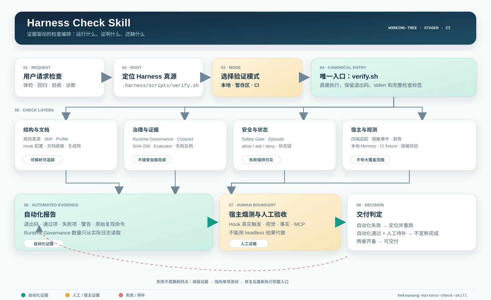
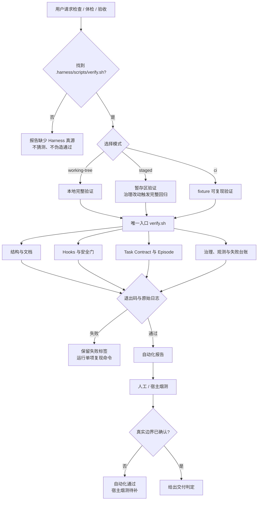

# hekouwang-harness-check-skill

> 面向 Agent Harness 的证据驱动检查器 Skill：选择正确的验证模式，调用唯一真源，保留退出码和原始证据，并把自动化通过、真实宿主烟测和人工验收明确分开。



这是一个独立发布的 Agent Skill 源仓库。它不重新发明测试框架，也不把“检查脚本运行过”包装成“任务已经完成”；它把目标 Harness 已有的检查能力编排成 Agent 可以稳定执行、解释和交接的工作流。

本仓库提供的是检查编排层，不捆绑某个具体项目的 `.harness/` 真源。接入项目需要提供自己的 `verify.sh`、契约、正反例和人工验收边界；[hekouwang-content-agent](https://github.com/huiyonghkw/hekouwang-content-agent) 是本 Skill 的首个参考实现。

## 目录

- [它解决什么问题](#它解决什么问题)
- [能力边界](#能力边界)
- [Harness Scorecard 打分系统](#harness-scorecard-打分系统)
- [七个核心验收优势](#七个核心验收优势)
- [快速开始](#快速开始)
- [三种验证模式](#三种验证模式)
- [完整检查层](#完整检查层)
- [流程图](#流程图)
- [输出协议](#输出协议)
- [安全不变量](#安全不变量)
- [开源移植](#开源移植)
- [维护与贡献](#维护与贡献)
- [已知边界](#已知边界)

## 它解决什么问题

Agent 工作流最容易出现的不是“没有测试”，而是测试结果不可相信：

| 常见失真 | 本 Skill 的处理 |
| --- | --- |
| Agent 自己说“完成了” | 使用 Task Contract、文件摘要、受限命令证据和独立 Evaluator 重跑 |
| 只跑一个总检查器 | 由 `verify.sh` 编排完整正反例套件，并保留每个失败标签 |
| 管道吞掉退出码 | 要求直接执行、读取真实退出码，不使用 `| head` 或 `|| true` 判断成功 |
| 本机通过被误写成 CI 通过 | 分离 `working-tree`、`staged` 和 `ci` 三种模式 |
| Headless 通过被误写成宿主通过 | 单独报告 Claude Code、Cursor、CodeBuddy、Codex 的真实烟测 |
| 722/165 被当成永久总分 | 从实际日志读取数量，并记录断言增加后的当前值 |
| 配置能解析被误写成 Hook 一定触发 | 明确语义校验、fixture 回归和真实宿主触发是三件事 |

## 能力边界

### 这个 Skill 负责

- 选择验证模式和检查入口；
- 调用仓库 `.harness/` 中的唯一真源；
- 解释退出码、通过项、失败项和警告；
- 分离自动化证据、宿主烟测和内容人工验收；
- 在失败时给出可复现的单项检查命令；
- 约束结果表述，防止把历史检查数量写成永久总分。

### 这个 Skill 不负责

- 替代 `.harness/scripts/verify.sh` 或复制它的检查逻辑；
- 擅自修复失败、执行适配链接 `--fix` 或绕过 Git Hook；
- 判断文章事实、来源、自然度和视觉质量已经合格；
- 证明真实宿主、浏览器、平台编辑器或 MCP 外部副作用已经验证；
- 把本地状态、Memory 或一次成功日志变成跨机器的权威数据库。

## Harness Scorecard 打分系统

这是本 Skill 的量化层，不把 `722/165` 这类检查数量当成质量分。评分器使用 12 个维度：规则与路由、验证入口、CI 可复现性、宿主适配、安全执行、证据与完成门、状态与恢复、可观测性、正反例回归、生命周期与漂移、文档可移植性、人工边界。

```bash
# 只扫描仓库结构，输出适合网页/GIF 的机器数据
python3 harness_score.py /path/to/harness \
  --format json --output ./harness-scorecard.json

# 在扫描前真实执行目标仓库的验证入口；模式可以重复
python3 harness_score.py /path/to/harness \
  --format markdown \
  --mode working-tree --mode ci

# 对内容 Agent 叠加领域 Profile（通用分和领域分分别输出）
python3 harness_score.py /path/to/harness \
  --profile content-agent --format json

# 对比修复前后的分数和每个维度变化
python3 harness_score.py /path/to/harness \
  --baseline ./before-scorecard.json --format markdown
```

输出同时包含：

- `score.value`：加权成熟度分，不是测试计数；
- `score.confidence`：静态证据、运行证据和人工/宿主证据的置信度；
- `score.caps`：缺少安全、反例、CI 或完成证据时的硬上限；
- `score.decision`：`READY`、`CONDITIONAL` 或 `BLOCKED`；
- `dimensions`：每个维度的得分、状态、证据强度和仓库相对路径；
- `hosts`：Claude Code、Cursor、CodeBuddy、Codex 的配置矩阵；没有真实触发证据时保持 `unknown`；
- `executions`：真实命令、退出码、耗时、动态检查数量和失败标签。
- `profile`：可插拔的领域评分；当前内置 `content-agent`，不把内容规则硬编码进通用 100 分。领域分还会标注 `evidenceKind` 和独立置信度，规则写进文档不等于运行证据。
- `comparison`：可选的 baseline 差异，供网页/GIF 展示修复前后的分数变化。

评分器会自动降权只有关键词或文档语义的线索；它们可以帮助发现问题，但不能替代脚本、契约、正反例或运行结果。这条规则是为了防止“README 看起来很完整”被误报成“Harness 已经可靠”。

### 与 DeepSeek Harness 的差异

[DeepSeek Harness](https://github.com/deepseek-ai/deepseek-harness) 的核心是插件化 Agent Runtime：把模型、工具、会话和 Agent Loop 组合并运行起来。这个 Skill 是独立的验收层：检查任何 Harness 是否具备可复核的规则、权限、CI、恢复、跨宿主和交付证据。两者不是替代关系；一个负责运行，一个负责证明运行边界值得信任。

完整对标与产品差异化方案见 [`references/market-positioning.md`](./references/market-positioning.md)。
网页和 GIF 的数据字段、分镜与离线展示边界见 [`references/demo-storyboard.md`](./references/demo-storyboard.md)。

## 七个核心验收优势

这不是另一个 Agent Runtime，而是一层可以叠加在任何 Harness 上的独立验收层：

1. **独立验收**：检查任何 Harness，而不是只服务某个模型或某个运行时。
2. **证据优先**：文件、行号、退出码、正反例和运行记录优先于 README 关键词；关键词只能降权计分。
3. **硬门槛**：缺少安全边界、CI、反例回归或完成证据契约时自动封顶，不能用文档数量刷高成熟度。
4. **跨状态**：分别检查 `working-tree`、`staged`、`ci`，不把本机通过冒充 CI 通过。
5. **跨宿主**：检查 Claude Code、Cursor、CodeBuddy、Codex 等适配；配置存在不等于 Hook 真触发，没有烟测证据就保持 `unknown`。
6. **垂直治理**：通过 `content-agent` Profile 检查已发布门、来源、渠道合同、生成物边界、视觉验收和外部副作用。
7. **可视化闭环**：JSON 可直接驱动网页、GIF、CI Artifact 和修复前后 `baseline` 对比。

这七点共同构成产品边界：DeepSeek Harness 等运行时负责把 Agent 跑起来，Harness Check 负责证明它的控制面和交付边界值得信任。

## 快速开始

### 在已接入的 Harness 仓库中调用

向 Agent 直接提出：

```text
$hekouwang-harness-check-skill
检查当前仓库 Harness，报告自动化结果、Runtime Governance 数量、失败项和真实宿主烟测边界。
```

也可以直接运行唯一验证入口：

```bash
# 当前工作区完整体检
bash .harness/scripts/verify.sh --working-tree

# 提交前检查暂存区
bash .harness/scripts/verify.sh --staged

# CI 可复现检查
bash .harness/scripts/verify.sh --ci
```

### 第一次接入

本 Skill 只在能找到以下真源时工作：

```text
<repo-root>/.harness/scripts/verify.sh
<repo-root>/.harness/scripts/harness-check.sh
<repo-root>/.harness/tests/
```

本仓库是 `hekouwang-harness-check-skill` 的 canonical source。目标项目通常把本仓库内容放到 `.agents/skills/hekouwang-harness-check-skill/`，再由项目自己的同步脚本建立各宿主适配链接。适配链接只解决“宿主能发现 Skill”，不改变目标项目的检查真源。

## 三种验证模式

| 模式 | 命令 | 检查范围 | 允许的结论 |
| --- | --- | --- | --- |
| `working-tree` | `verify.sh --working-tree` | 工作区空白、Harness 总检查、全部正反例、适配链接、本机 Memory | “当前本地自动化检查通过/失败” |
| `staged` | `verify.sh --staged` | 先检查暂存区；治理文件进入暂存区时跑完整 Harness | “本次暂存内容通过/失败” |
| `ci` | `verify.sh --ci` | 仓库 fixture、治理审计和全部可复现正反例 | “CI 环境自动化检查通过/失败” |

注意：`--staged` 对只包含普通内容文件的提交可能只做暂存区空白检查；治理文件变更才会触发完整 Harness。这是为了避免每次写文章都运行重型治理回归。

`working-tree` 读取本机 Skill 和 Memory，可能产生脱敏观测事件；`ci` 使用仓库 fixture，跳过本机外部 Skill/Command 符号链接和未随 Harness 提交的内容 EP 契约。二者不能互相冒充。

## 完整检查层

`verify.sh` 是编排器；每个底层检查仍然拥有自己的真源和正反例：

| 检查层 | 主要入口 | 证明什么 |
| --- | --- | --- |
| Harness 总检查 | `.harness/scripts/harness-check.sh` | 规则真源、薄适配、Skill、四端 Hook、生成物、治理契约、文档链接 |
| 贴图提醒 | `test-build-reminder.sh` | 四端输入归一化、应该提醒和应该静默的路径 |
| 检查器 Skill | `test-harness-check-skill.sh` | Skill 本身包含三种模式、结果分层和矩阵引用 |
| Hook 配置 | `test-hook-config.sh` | JSON、事件、真源路径、failClosed 和宿主挂载语义 |
| 适配链接 | `test-adapter-links.sh` | 旧名链接能被拦截，修复模式能建立正确链接 |
| Runtime Governance | `test-runtime-governance.sh` | 行为契约、设计契约、组件生命周期、Hook、Memory 和漂移反例 |
| 可观测性 | `test-observability.sh` | 事件脱敏、开关和失败趋势摘要 |
| Task Contract | `test-task-contract.sh` | 文件摘要、路径边界、安全命令、人工证据和完成门 |
| Safety Gate | `test-safety-gate.sh` | 强制推送、危险 Git、敏感文件等动作的 allow/ask/deny |
| Episode | `test-episode.sh` | 状态转移、锁、原子写入、事件链、检查点和独立完成门 |
| Failure Ledger | `test-failure-ledger.sh` | 失败记录、回归证据和退役条件不能缺失 |

当前 Runtime Governance 的历史基线是本地 722、CI 165 项；纳入本 Skill 的组件和路由断言后，当前实测为本地 728、CI 171 项。它们是断言数量，不是质量分数；新增断言后必须以日志为准。

## 流程图

### 静态 SVG

适合 README、文档站和离线预览：[`assets/harness-check-flow.svg`](./assets/harness-check-flow.svg)。

### Mermaid 源码

适合 GitHub、GitLab 或支持 Mermaid 的文档系统：



## 输出协议

最终报告必须把机器证据和人类判断分开。推荐使用下面的最小格式：

```text
Harness 检查报告

模式：working-tree / staged / ci
仓库与提交：<repo-root> / <git rev-parse HEAD>
入口：<完整命令>

自动化结论：通过 / 失败 / 警告
Runtime Governance：本地 N 项 / CI M 项 / 未输出
通过项：<检查标签>
失败项：<原始标签、退出码、复现命令>
警告项：<例如 Memory 未提交>

宿主烟测：已完成 / 待补
- Claude Code：<事件与结果>
- Cursor：<事件与结果>
- CodeBuddy：<事件与结果>
- Codex：<事件与结果>

人工验收：已完成 / 待补
- 视觉：<结果>
- 事实与来源：<结果>
- 外部副作用 / MCP：<结果>

最终判定：可交付 / 自动化通过但不可宣称完成 / 阻断
```

### 结果解释规则

- 退出码非零就是自动化失败，即使日志中有若干成功项目；
- `⚠️` 是警告，不等于通过；
- 没有输出、输出被截断或命令没有真正执行，不能解释为通过；
- 自动化通过只说明编码过的机械性断言通过；
- 真实宿主烟测和人工内容验收没有证据时，必须写“待补”；
- 722/165 或 728/171 都不能写成“分数”或“所有事情完成”。

## 安全不变量

这个 Skill 的安全要求是行为约束，不是建议：

1. 保留底层命令的真实退出码，不用管道吞错；
2. 不使用 `git commit --no-verify` 或其他方式绕过验证；
3. 不修改测试计数、删除反例、降低 `failClosed` 或放宽危险动作规则来制造通过；
4. 不未经用户明确要求运行适配链接 `--fix` 或修复代码；
5. 不把执行者自报完成当成独立证据；
6. 文件和产物证据必须能定位到仓库内，并绑定 SHA-256；
7. 命令证据使用受限 `argv`，由 Evaluator 在仓库内重跑；
8. 人工证据必须有审阅人、时间、记录路径和 `decision=pass`；
9. MCP、真实浏览器和平台发布动作必须单独报告外部副作用风险；
10. 结果摘要不记录提示词、正文或敏感文件内容。

## 开源移植

### 复用等级

| 等级 | 需要什么 | 能得到什么 |
| --- | --- | --- |
| 完整复用 | 当前仓库的 `.harness/`、契约、测试、Memory 和宿主适配 | 完整的本地 / 暂存区 / CI Harness 检查闭环 |
| Harness 复用 | 自己的 `.harness/scripts/verify.sh`、测试目录和退出码协议 | 保留模式选择、结果解释和人工边界报告 |
| Skill 仅复用 | 任何能提供 `verify.sh` 的仓库 | 使用本 Skill 的检查编排和报告规范 |

### 目标仓库的最小契约

要把 Skill 放进另一个项目，目标项目至少应提供：

```text
.harness/scripts/verify.sh --working-tree
.harness/scripts/verify.sh --staged
.harness/scripts/verify.sh --ci
```

三个模式必须有稳定的退出码：`0` 表示该模式的自动化检查通过，非 `0` 表示失败。项目可以替换检查内容，但不能让 Skill 通过猜测日志或固定数字判断结果。

### 需要项目化适配的部分

- `AGENTS.md`、Memory 和内容 Skill 的名称；
- 四端 Hook 配置和宿主实际事件；
- 内容交付、视觉验收和平台发布规则；
- Task Contract 的领域字段；
- Runtime Governance 的组件注册表与失败分类。

不要把会勇禾口王内容工作流的事实、渠道规则或品牌视觉直接复制到通用项目；保留 Harness 的证据边界，替换领域真源。

## 安装与发现

### 仓库内安装

将目录放到：

```text
.agents/skills/hekouwang-harness-check-skill/
```

从 GitHub 安装的最小方式：

```bash
git clone https://github.com/huiyonghkw/hekouwang-harness-check-skill.git \
  .agents/skills/hekouwang-harness-check-skill
```

让各宿主发现它：

```bash
bash .harness/scripts/sync-agent-adapters.sh --check
```

如果确实需要建立或修正链接，必须由用户明确要求后再运行：

```bash
bash .harness/scripts/sync-agent-adapters.sh --fix
```

### 全局安装的边界

这个 Skill 不是 npm 或 PyPI 包，也不需要网络服务、API Key 或远程数据库。它依赖目标项目提供自己的 `.harness/` 实现；安装 Skill 不会替目标项目自动生成检查脚本、Hook 或治理契约。

## 维护与贡献

新增或修改 Harness 能力时，按以下顺序处理：

1. 修改唯一真源：脚本、契约或宿主适配；
2. 增加一个应命中的正例和一个应放过的反例；
3. 更新组件生命周期注册表、Workflow Profile 或运行时契约；
4. 更新 `SKILL.md`、本 README、检查矩阵和流程图（如果流程发生变化）；
5. 更新本仓库的 [更新日志](./CHANGELOG.md)；
6. 运行：

   ```bash
   bash .harness/scripts/verify.sh --working-tree
   bash .harness/scripts/verify.sh --ci
   bash .harness/scripts/docs-check.sh
   bash .harness/scripts/sync-agent-adapters.sh --check
   ```

7. 报告自动化结果和人工 / 宿主待补边界；
8. 需要提交时再由用户明确授权 commit 和 push。

推荐阅读：

- [SKILL.md](./SKILL.md)：给 Agent 的执行规则；
- [检查矩阵](./references/check-matrix.md)：命令范围和数量口径；
- [参考 Harness 的 AGENTS.md](https://github.com/huiyonghkw/hekouwang-content-agent/blob/main/AGENTS.md)：首个参考实现的运行时红线；
- [参考 Harness 的验证与治理流程](https://github.com/huiyonghkw/hekouwang-content-agent/blob/main/%E9%AA%8C%E8%AF%81%E4%B8%8E%E6%B2%BB%E7%90%86%E6%B5%81%E7%A8%8B.md)：仓库级治理说明。

## 故障排查

| 现象 | 优先检查 |
| --- | --- |
| 找不到 Harness 真源 | 确认当前目录是仓库根，且存在 `.harness/scripts/verify.sh` |
| 本地通过、CI 失败 | 对比 `--working-tree` 与 `--ci`，检查是否误依赖本机 Skill、Memory 或生成物 |
| 适配链接失败 | 运行 `sync-agent-adapters.sh --check`，先定位漂移，不要自动 `--fix` |
| Evaluator 报摘要不一致 | 重新计算证据文件 SHA-256，确认文档改动同步更新 fixture |
| 检查数量变化 | 以 Runtime Governance 实际日志为准，检查是否新增或删除了断言 |
| Hook 配置通过但宿主无反应 | 将其标记为宿主烟测问题，检查真实事件名、输入形状和宿主日志 |
| `quick_validate.py` 缺少 PyYAML | 安装 Skill Creator 的验证依赖，或至少用可用 YAML 解析器验证 frontmatter；不能把未执行写成通过 |

## 已知边界

当前参考实现仍有明确边界：

- 四个真实宿主的允许、询问、阻断路径需要人工触发；
- Cursor 直接文件编辑仍主要是事后提醒，不等同于事前阻断；
- `find`、`xargs`、脚本删除、`tee` 和重定向等间接危险动作还需要更细的解析或沙箱策略；
- MCP 当前统一进入人工确认，尚未按只读和外部副作用做细粒度分级；
- Episode、失败台账和观测事件仍是本地状态，不是跨机器数据库。

“开源”不意味着隐藏这些限制。一个值得复用的 Harness，首先要让使用者知道它证明了什么、没有证明什么。

## 许可证

本仓库按 MIT License 发布，版权归 `huiyonghkw` 所有。许可证只覆盖本仓库中的 Skill、文档和资源；目标项目的 `.harness/` 脚本、契约、Memory、媒体和第三方依赖仍由目标项目自行负责。
