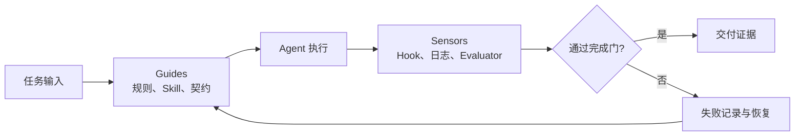

# Harness 从 0 到可验收：小白完整学习与实践指南

> 本文根据用户提供的《Harness 小白完整入门教程（搭建你的挽具工程）》36 页 PDF 整理，并补充独立验收、证据契约、跨状态、跨宿主和 CI 复现部分。
>
> 原文的核心问题是“如何把 AI 管起来”；本指南再多问一步：“你怎么证明它真的被管住了？”

## 先记住一句话

```text
Agent = Model + Harness
```

`Model` 提供生成、推理和规划能力；`Harness` 是包在模型外面的工程控制面，负责告诉它应该怎么做、能做什么、什么时候必须停、做完以后如何检查，以及出了问题怎样恢复。

如果只有模型，Agent 往往会出现四种失真：

- 把“我希望它这样做”当成“它必须这样做”；
- 把“工具已经接上”当成“工具使用正确”；
- 把“回答完成了”当成“任务已经完成”；
- 把“本机跑过了”当成“所有宿主和 CI 都成立”。

Harness 的价值，就是把这些口头期待变成可以执行、可以阻断、可以复查的机制。

## 1. 为什么装好工具，AI 还是会犯错

### 1.1 前置配置不是完整工作流

一个常见的起点是：

- 装好 Claude Code 或其他 Agent 宿主；
- 写一份 `CLAUDE.md`，告诉 AI 你的偏好和红线；
- 安装几个 Skill，让它知道某类任务怎么做；
- 接入 MCP，让它能搜索、读写文件或调用平台。

这些东西解决的是“AI 能看到什么、可以尝试什么”。它们很重要，但主要位于任务开始之前。

真正容易出错的地方发生在后面：

- AI 是否真的按规则执行，而不是只在回答里复述规则；
- 危险动作是否能在模型外被拦截；
- 产物是否被独立检查，而不是由执行者自评；
- 失败时是否留下了下一次能复用的记录；
- 换一个宿主、换一个状态、换一台机器后，门禁是否仍然成立。

所以 Harness 不是“多写一份提示词”，而是给 Agent 增加控制、验证和恢复。

### 1.2 Guides 与 Sensors

原教程把 Harness 的组件分成两类，适合用来建立直觉：

| 类别 | 作用 | 常见组件 | 它回答的问题 |
| --- | --- | --- | --- |
| Guides | 引导 AI 怎么做 | `CLAUDE.md`、Skills、Subagent、Sprint Contract | “正确路径是什么？” |
| Sensors | 感知并约束 AI 做了什么 | Hook、Evaluator、日志、CI、失败台账 | “它实际上做对了吗？” |

只增加 Guides，系统会变成一大堆说明；只增加 Sensors，系统会知道出错，却不知道正确路径。可靠 Harness 需要两边成环：



### 1.3 “能跑”不等于“能交付”

可以把一个 Agent 工作流拆成五个问题：

1. 它知道任务是什么吗？
2. 它知道哪些动作允许、哪些动作危险吗？
3. 它执行后有人或有机制独立检查吗？
4. 它失败后能恢复到一个可识别状态吗？
5. 你能拿出文件、命令、退出码和记录证明以上事实吗？

前两个问题通常靠 Guides；后三个问题需要 Sensors、契约和验收层。缺任何一段，最后的“完成”都可能只是模型自报。

## 2. Harness 的分层结构

推荐把一个 Harness 看成四层，而不是一张配置文件：

```text
┌──────────────────────────────────────────────┐
│ 交付层：产物、发布门、人工验收、外部副作用        │
├──────────────────────────────────────────────┤
│ 证据层：Evaluator、Task Contract、CI、报告、台账   │
├──────────────────────────────────────────────┤
│ 控制层：Hook、安全门、状态机、恢复、权限           │
├──────────────────────────────────────────────┤
│ 引导层：CLAUDE.md、Skills、MCP、Subagent、上下文    │
└──────────────────────────────────────────────┘
```

四层的职责不同：

- 引导层减少“不会做”；
- 控制层阻止“不能做”；
- 证据层判断“做没做对”；
- 交付层确认“能不能交给别人”。

### 2.1 一个最小 Harness 的组成

小白不需要第一天就搭满所有组件。最小可用版本至少应该有：

```text
my-harness/
├── CLAUDE.md                       # 项目级规则和完成标准
├── .agents/skills/                 # 可复用工作流
├── .harness/
│   ├── scripts/verify.sh           # 唯一验证入口
│   ├── hooks/                      # 模型外安全边界
│   ├── contracts/                  # 行为和完成契约
│   ├── tests/fixtures/             # 正例和反例
│   └── failures.md                 # 失败台账
└── .github/workflows/              # 干净环境中的 CI 复现
```

没有 `.harness/scripts/verify.sh` 时，可以先学习 Harness 的构建部分，但不能宣称已经具备独立验收能力。没有反例、退出码和完成证据时，同样不能把文档数量当作可靠性。

## 3. 从 0 开始：先做一个能闭环的版本

### 第 1 步：先写任务边界，不要先堆工具

用一页纸回答：

- 这个 Agent 负责哪类任务？
- 输入和输出分别是什么？
- 哪些路径允许读写？
- 哪些动作必须询问？
- 哪些动作必须阻断？
- 什么证据出现后才算完成？

如果这些问题没有答案，先接十个 MCP 通常只会增加不确定性。

### 第 2 步：写第一版 `CLAUDE.md`

第一版只写稳定、具体、能判断对错的规则。例如：

```markdown
# 项目工作规则

## 工作范围
- 只修改当前仓库内的源码和配置。
- 生成物放入临时目录，截图验收后删除中间 HTML。

## 危险动作
- 删除、强制推送、覆盖外部平台内容前必须先询问。
- 不使用 `--no-verify` 绕过检查。

## 完成标准
- 运行对应的验证命令并保留退出码。
- 报告修改文件、验证命令、结果和仍待人工确认的边界。
```

好的规则有三个特征：

1. 能由人或脚本判断是否违反；
2. 写清触发条件和动作，而不是只写“注意安全”；
3. 写清完成证据，而不是只写“完成后告诉我”。

### 第 3 步：把重复流程做成 Skill

当一套步骤重复出现，才把它抽成 Skill。一个 Skill 应至少说明：

- 什么时候触发；
- 输入是什么；
- 输出文件是什么；
- 哪些步骤必须执行；
- 哪些步骤必须交给人确认；
- 失败时如何停止和恢复。

Skill 解决“怎么稳定地做一类事”，不应该把所有项目规则复制进去。项目级规则留在项目真源，Skill 只保留可迁移的工作流能力。

### 第 4 步：谨慎接入 MCP

MCP 让 Agent 获得外部能力，但能力越大，外部副作用越需要单独治理。接入前先给工具分类：

| 类型 | 示例 | 默认策略 |
| --- | --- | --- |
| 只读 | 搜索、查询、读取 | 可自动执行，但保留调用记录 |
| 仓库内写入 | 修改源码、生成文件 | 受路径边界和完成门约束 |
| 外部写入 | 发帖、发消息、更新草稿 | 必须人工确认，记录目标和结果 |
| 不可逆动作 | 删除、强推、发布、付款 | 模型外阻断或明确二次确认 |

“MCP 已连接”只证明工具可发现，不证明权限正确、输入安全或外部动作已经得到确认。

## 4. `CLAUDE.md`：从愿望清单升级为规则系统

### 4.1 为什么很多 `CLAUDE.md` 不好用

典型问题是把所有愿望写在一起：

```markdown
- 中文回复
- 代码写好一点
- 注意安全
- 不要犯错
- 输出到 outputs/
```

这些内容并非都错，但它们缺少触发条件、动作和证据。AI 可以读到，却很难稳定执行，也很难在失败后定位是哪一条出了问题。

### 4.2 推荐的规则结构

```markdown
# 项目身份

## 输入与输出
- 输入：...
- 输出：...
- 不纳入版本库：...

## 路由
- 如果用户要求 X，调用 Skill A。
- 如果涉及外部发布，先进入人工确认。

## 安全边界
- 命中危险命令 Y 时，阻断并解释原因。
- 涉及路径 Z 时，只允许读，不允许写。

## 验证与完成
- 命令：`bash .harness/scripts/verify.sh --working-tree`
- 必须有：退出码、关键日志、产物路径、人工验收字段。

## 恢复
- 失败时记录：现象、根因、修复、回归命令。
```

### 4.3 规则的生命周期

`CLAUDE.md` 不是一次性作文，而是会迭代的运行时文档：

1. 先写最小规则；
2. 记录真实失败；
3. 判断失败属于引导、控制、验证还是恢复缺口；
4. 把稳定经验提升为规则或自动检查；
5. 为规则增加正例和反例；
6. 定期删除已经不成立的旧规则。

规则如果只越来越长，却没有对应的失败记录、测试和退役条件，通常说明系统在堆叙述，而不是在工程化。

### 4.4 规则的作用域和冲突

至少区分三种作用域：

- 全局规则：跨项目都成立的安全红线；
- 项目规则：当前仓库的路径、交付和验证要求；
- 任务规则：本次用户明确指定的范围和例外。

发生冲突时，应保留冲突记录并明确优先级，不让多个文件通过“谁最后被模型读到”决定结果。高风险规则最好同时下沉到 Hook 或脚本，让它不依赖上下文记忆。

## 5. Hook：把关键红线放到模型外

### 5.1 为什么 Hook 不能被提示词替代

`CLAUDE.md` 可以告诉 AI“不要执行 `rm -rf`”；Hook 可以在工具真正执行前检查输入，并返回允许、询问或阻断。

这两者的关系是：

```text
CLAUDE.md：告诉 Agent 规则是什么
Hook：在危险动作发生前执行规则
```

对不可逆动作，只把规则写在提示词里相当于让执行者自己监督自己。

### 5.2 常见 Hook 位置

以 Claude Code 为例，Hook 通常挂在 `settings.json`：

```text
macOS / Linux: ~/.claude/settings.json
Windows:       %USERPROFILE%\\.claude\\settings.json
```

常用事件是 `PreToolUse`。但路径和事件名只是配置层证据，不能证明真实宿主一定触发。必须再用正例、反例和真实烟测验证：

- 正例：普通安全命令可以继续；
- 反例：危险命令必须被拒绝或询问；
- 宿主烟测：从真实 Agent 宿主发起一次调用，并保留结果。

### 5.3 三个最小安全例子

#### 例子一：阻断递归删除

匹配 `rm -rf`、删除根目录或工作区外路径；不要只匹配一个字符串就宣称安全，至少覆盖空格、参数顺序、脚本包装和重定向等变体。

#### 例子二：阻断强制推送

匹配 `git push --force`、`-f` 以及项目规定的保护分支。允许策略也要绑定当前分支和远端，而不是只看命令中有没有 `git push`。

#### 例子三：保护敏感文件

对 `.env`、凭证、私钥和授权配置的写入默认询问或阻断；检查 `Write`、`Edit` 和脚本间接写入，不要只保护手工编辑器事件。

### 5.4 Hook 的 fail-closed 原则

当 Hook 解析失败、输入形状未知、脚本不存在或权限不足时，关键危险动作应该停下来，而不是自动放行。日志必须回答：

- 触发了哪个事件；
- 输入被如何归一化；
- 命中了哪条规则；
- 最终是 allow、ask 还是 deny；
- 退出码是什么。

## 6. Subagent 与 Evaluator：不要让执行者给自己打分

### 6.1 为什么需要独立角色

一个 Agent 既负责执行，又负责宣布完成时，会产生系统性偏差：它倾向于把“自己做过”解释成“自己做对了”。

可以把角色拆成：

```text
主 Agent：执行任务
子 Agent：独立检查产物
Evaluator：按契约重跑关键验证
人：确认真实宿主、视觉、事实和外部副作用
```

子 Agent 不需要知道所有上下文，反而应该只拿到检查需要的输入和规则。

### 6.2 一个审查子 Agent 的最小契约

```markdown
---
name: reviewer
description: 独立检查 Agent 产物，不修改目标文件
---

## 工作规则
1. 不接受主 Agent 的“已完成”作为证据。
2. 至少提出 3 个潜在问题或明确说明检查范围。
3. 自动化检查必须给出命令和退出码。
4. 发现缺证据时返回 partial 或 blocked，不猜测通过。

## 输出
- 检查对象
- 已验证事实
- 未验证边界
- 问题与严重级别
- 可复现命令
- 最终 decision
```

### 6.3 Task Contract：定义“完成”是什么

完成契约不要只写一句“任务完成”。至少包含：

- 目标和允许修改范围；
- 期望产物及其路径；
- 必须运行的验证命令；
- 文件摘要或版本指纹；
- 安全命令边界；
- 自动化证据；
- 人工验收字段；
- 未完成项和恢复入口。

一个能复核的完成记录应该类似：

```text
target: ./my-harness
command: bash .harness/scripts/verify.sh --ci
exit: 0
artifact: scorecard.json
sha256: <digest>
human_review: pending
decision: CONDITIONAL
```

## 7. 长任务的高级 Harness：上下文重置、评估器、Sprint Contract

### 7.1 Context Reset

长任务中，模型会因为上下文增长而忘记早期约束。Context Reset 的作用不是简单清空聊天，而是用一份结构化状态重新装载：

- 目标是什么；
- 已完成什么；
- 当前状态是什么；
- 哪些证据已经存在；
- 哪些风险仍未关闭；
- 下一步只能做什么。

重置后必须重新加载关键规则和任务契约，不能只把最后一句“继续完成”发给模型。

### 7.2 Sprint Contract

一个大任务可以拆成短周期，每个周期有明确的输入、输出和完成门：

```text
Sprint N
├── 输入：上一个 checkpoint + 当前目标
├── 动作：限定范围内的实现
├── 检查：正例、反例、Evaluator
├── 输出：产物 + 证据 + 未决风险
└── checkpoint：可恢复状态
```

Sprint Contract 解决“做了很多，但不知道做到哪里”的问题。每个 Sprint 结束时要留下可独立读取的结果，不能依赖完整聊天记录。

### 7.3 什么时候应该拆掉组件

组件不是越多越高级。可以逐个追问：

- 这个 Skill 最初要补哪个缺口？
- 这个 Hook 阻止了哪类真实失败？
- 这个 Subagent 是否提供了主 Agent 没有的独立判断？
- 这个 MCP 是否带来不可替代的能力？
- 这个规则是否已经被模型、脚本或组件重复表达？

模型能力变强后，某些脚手架可能从“必要护栏”变成“上下文噪声”。有证据地退役组件，同样是 Harness 工程的一部分。

## 8. `failures.md`：把失败变成下一次的防护

失败日志不是抱怨区，而是 Harness 的训练数据和回归入口。每条失败至少记录：

```markdown
## 2026-08-17 [误删草稿目录]

### 现象
Agent 把“清理旧版本”解释成删除整个 drafts/。

### 我当时让它做什么
清理 drafts/ 下名称含 old 或 backup 的目录。

### 期望结果 vs 实际结果
期望：只删除匹配的子目录。
实际：执行了递归删除，误伤其他草稿。

### 根因
- CLAUDE.md 没有写精确删除范围；
- 没有反例验证路径边界；
- Hook 没有拦截危险删除。

### 防再犯规则
- 规则：删除必须先列出目标并逐项确认；
- Hook：递归删除默认 deny；
- 回归：保留一个应阻断的 fixture 和一个应放行的 fixture。

### 证据
- 命令：...
- 退出码：...
- 回归命令：...
```

每条失败都要完成一次转换：

```text
失败现象 → 根因分类 → 规则/Hook/测试修复 → 正反例回归 → 记录修复证据
```

### 8.1 根因分类

推荐把失败归入以下类别，而不是只写“AI 犯错”：

- 规则缺失：Guide 没有告诉它边界；
- 路由错误：调用了不该调用的 Skill 或工具；
- 控制缺失：危险动作没有模型外门禁；
- 验证缺失：没有独立检查或反例；
- 状态丢失：上下文重置或恢复后不知道当前进度；
- 宿主差异：配置在一个宿主成立，另一个宿主不触发；
- 外部副作用：真实平台动作没有人工确认或记录。

## 9. 原教程之外：独立验收层补全了什么

原教程主要讲“如何搭建控制面”。`hekouwang Harness Doctor` 站在控制面之外，回答“这套控制面是否有可信证据”。两者是上下游关系：

| 构建问题 | 独立验收问题 |
| --- | --- |
| 有没有 `CLAUDE.md`？ | 规则是否可执行、可发现、没有冲突？ |
| 有没有 Hook？ | Hook 是否有正反例，真实宿主是否触发？ |
| 有没有 CI？ | CI 是否复现本地关键门禁，退出码是否真实？ |
| 有没有完成标准？ | 完成是否绑定产物摘要、命令和人工证据？ |
| 有没有失败日志？ | 失败是否转成回归规则，是否仍在漂移？ |
| 这次跑成功了吗？ | working-tree、staged、CI 是否分别成功？ |

### 9.1 五个必须分开的状态

#### 工作区 `working-tree`

回答“当前机器上，包括未提交改动，自动化检查是否通过”。它可能依赖本机 Skill、Memory 和宿主配置。

#### 暂存区 `staged`

回答“准备提交的那组改动是否通过”。不能把工作区里尚未暂存的修复带进结论。

#### CI `ci`

回答“在干净、可复现环境中，仓库随提交携带的证据是否通过”。CI 不能默认相信本机路径、全局 Skill 或本地 Memory。

#### 真实宿主 `smokeTest`

回答“Claude Code、Cursor、CodeBuddy、Codex 等宿主是否真的触发了配置”。配置存在只能记为 `configured`；没有触发记录就保持 `unknown`。

#### 人工验收 `humanReview`

回答“视觉、事实、来源、自然度、外部副作用等需要人的部分是否真的看过并确认”。自动化不能替人签字。

### 9.2 分数不是检查数量

本 Skill 的 Scorecard 有 12 个加权维度：

1. 规则与路由；
2. 验证入口；
3. CI 可复现性；
4. 宿主适配；
5. 安全执行；
6. 证据与完成门；
7. 状态与恢复；
8. 可观测性；
9. 正反例回归；
10. 生命周期与漂移；
11. 文档与可移植性；
12. 人工边界。

本地或 CI 的治理检查数量，只表示断言数量。它不能直接等于质量分，也不能证明真实宿主或人工验收完成。

### 9.3 硬门槛

以下缺口不能靠 README 长度、组件数量或测试数量补回来：

- 没有可执行验证入口；
- 没有 CI 可复现门禁；
- 没有模型外安全执行边界；
- 没有负向回归；
- 没有完成证据契约。

这就是“没有证据，就不能通过”的工程化版本。

### 9.4 内容 Agent 的垂直补充

通用 Harness 之外，内容工作流还需要检查：

- 选题是否已发布，避免重复生产；
- 事实是否有来源和统计口径；
- 公众号、头条、小红书等渠道合同是否满足；
- 生成 HTML、图片、视频等产物边界是否清晰；
- 视觉检查是否真的有人看过；
- 浏览器、MCP 和平台发布是否造成外部副作用。

这些内容适合通过 `content-agent` Profile 叠加，不应硬编码进通用评分器。

## 10. 从初级到高级的成熟度路线

下面的等级对应当前 Scorecard 的成熟度区间。分数只是摘要，真正升级仍要补证据。

| 等级 | 名称 | 典型状态 | 下一步 |
| --- | --- | --- | --- |
| L0 | 叙事型 | 主要靠 README 和模型自报 | 建唯一验证入口 |
| L1 | 已搭建 | 有规则和基础脚本，但证据闭环不完整 | 加安全门、正反例和 CI |
| L2 | 可重复 | 自动化回归可以重跑 | 补证据契约、恢复和宿主矩阵 |
| L3 | 证据门控 | 完成和危险动作由独立证据控制 | 补跨宿主和漂移管理 |
| L4 | 跨宿主治理 | 多宿主、CI、恢复和失败闭环基本成形 | 补真实烟测与人工记录 |
| L5 | 可发布 | 关键门禁、证据和真实边界均有交付记录 | 持续做 baseline 和回归 |

## 11. 一条适合小白的实践顺序

不要一次搭满。按下面的顺序，每一步都留下一个能失败的例子：

1. 写一份短而具体的 `CLAUDE.md`；
2. 选一个重复工作流做成 Skill；
3. 只接入必要的 MCP，并给外部写入分级；
4. 为删除、强推、敏感文件写 Hook；
5. 为完成声明增加 Task Contract；
6. 加一个独立 Reviewer 或 Evaluator；
7. 把失败写进 `failures.md`，并转成正反例；
8. 建立 `verify.sh --working-tree / --staged / --ci`；
9. 增加 checkpoint、恢复和 Context Reset；
10. 做真实宿主烟测，明确记录 `unknown` 和 `pending`；
11. 用 Scorecard 生成 JSON、网页、CI Artifact 和修复前后对比。

### 最小验收清单

```text
[ ] 规则有来源、有作用域、有退役条件
[ ] Skill 有触发条件、输入、输出和失败路径
[ ] MCP 按只读、仓库写入、外部写入、不可逆动作分级
[ ] 危险动作有模型外 Hook 或安全门
[ ] 至少一个正例和一个反例
[ ] 有唯一 verify.sh，保留真实退出码
[ ] working-tree、staged、ci 分开检查
[ ] 完成声明绑定产物、命令和摘要
[ ] 有失败台账和恢复路径
[ ] 宿主烟测与人工验收单独记录
[ ] 报告能被网页、CI 或下一位维护者复核
```

## 12. 直接运行 Harness Doctor

在一个已经提供 `.harness/scripts/verify.sh` 的仓库根目录运行：

```bash
python3 /path/to/hekouwang-harness-check-skill/harness_score.py . \
  --profile content-agent \
  --mode working-tree \
  --mode ci \
  --format terminal \
  --live \
  --color always
```

归档机器数据：

```bash
python3 /path/to/hekouwang-harness-check-skill/harness_score.py . \
  --profile content-agent \
  --mode working-tree --mode ci \
  --format json \
  --output harness-scorecard.json
```

报告至少应读四个位置：

- `score`：分数、置信度、成熟度、决策和硬门槛；
- `dimensions`：每个维度的状态、信号和证据；
- `executions`：真实命令、退出码、耗时和治理检查数量；
- `hosts` / `profile`：宿主边界与领域治理，不把配置声明冒充真实触发。

### 录制产品演示时

面向人看的动态终端使用：

```bash
python3 harness_score.py /path/to/harness \
  --profile content-agent \
  --mode working-tree --mode ci \
  --format terminal --live --color always
```

`--format json` 适合存档，不适合直接做终端视觉演示；它的完整维度、证据和执行记录写在 JSON 文件里。

## 13. 文章主线与本指南的补全关系

PDF 的章节可以这样阅读：


| PDF 主线 | 本指南对应内容 | 读者带走的能力 |
| --- | --- | --- |
| 第 1 章：为什么工具齐了仍然不可靠 | 第 1 节 | 理解 Agent = Model + Harness |
| 第 2 章：AI 的前置与后置缺口 | 第 2、3 节 | 区分 Guides 与 Sensors |
| 第 3 章：Harness 的两类武器 | 第 4、5、6 节 | 会写规则、接 Hook、拆独立角色 |
| 第 4 章：CLAUDE.md 升级 | 第 4 节 | 从愿望清单写成可执行契约 |
| 第 5 章：Hook | 第 5 节 | 把危险边界放到模型外 |
| 第 6 章：Subagent | 第 6 节 | 让独立角色检查执行者 |
| 第 7 章：更完整的 Harness | 第 7 节 | 使用 Context Reset、Evaluator、Sprint Contract |
| 第 8 章：失败日志 | 第 8 节 | 把失败转成规则和回归 |
| 原文未充分展开的验收问题 | 第 9、10、12 节 | 用退出码、证据、状态和宿主边界证明结果 |

原文中的实验数字、比例和案例用于说明观点，不应被当作所有项目的永久阈值。真正接入时，以目标仓库的实际命令、日志、fixture、宿主烟测和人工记录为准。

## 14. 术语表

| 术语 | 解释 |
| --- | --- |
| Harness | 包在模型外的规则、工具、权限、验证、恢复和交付控制面 |
| Guide | 引导 Agent 的规则、Skill、契约和上下文 |
| Sensor | 感知、拦截或验证 Agent 行为的 Hook、Evaluator、日志和 CI |
| Hook | 在工具动作前后运行的模型外检查或控制器 |
| Evaluator | 独立按照标准检查结果的执行器或角色 |
| Task Contract | 规定目标、范围、产物、验证和完成证据的契约 |
| Context Reset | 用结构化状态重新装载长任务，而不是继续依赖旧聊天上下文 |
| Sprint Contract | 将大任务拆成可验证、可恢复短周期的契约 |
| Smoke test | 在真实宿主中触发一次行为并留下结果证据 |
| Hard cap | 缺少关键证据时对分数或决策施加的硬上限 |
| Profile | 在通用评分之上叠加的领域治理规则 |

## 来源与使用边界

本文的入门到高级主线来自用户提供的 PDF 快照《Harness 小白完整入门教程（搭建你的挽具工程）》，署名黄小木（`@ai_xiaomu`）；PDF 共 36 页。原始文章入口为 [@ai_xiaomu 的 X 帖子](https://x.com/ai_xiaomu/status/2061003331531862349)。本文对原文进行了结构化转述，并新增 Harness Doctor 的独立验收部分。

原教程适合回答“怎么搭”；本指南和 Harness Doctor 还要回答“怎么验”。阅读任何 Harness 文档时，都应把声明、自动化证据、真实宿主烟测和人工验收分开，不用单一分数掩盖未验证边界。
